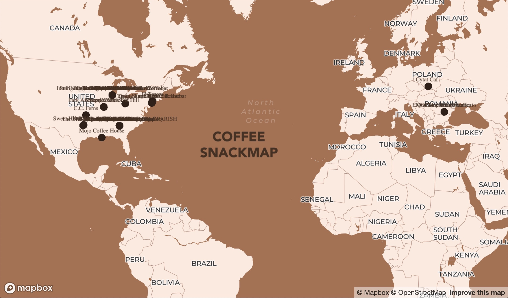
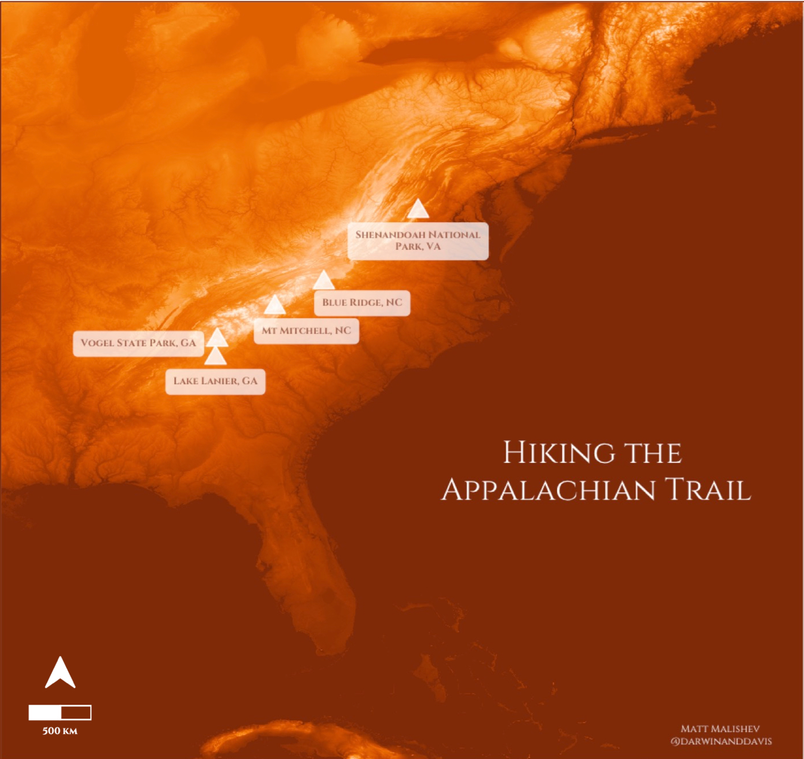
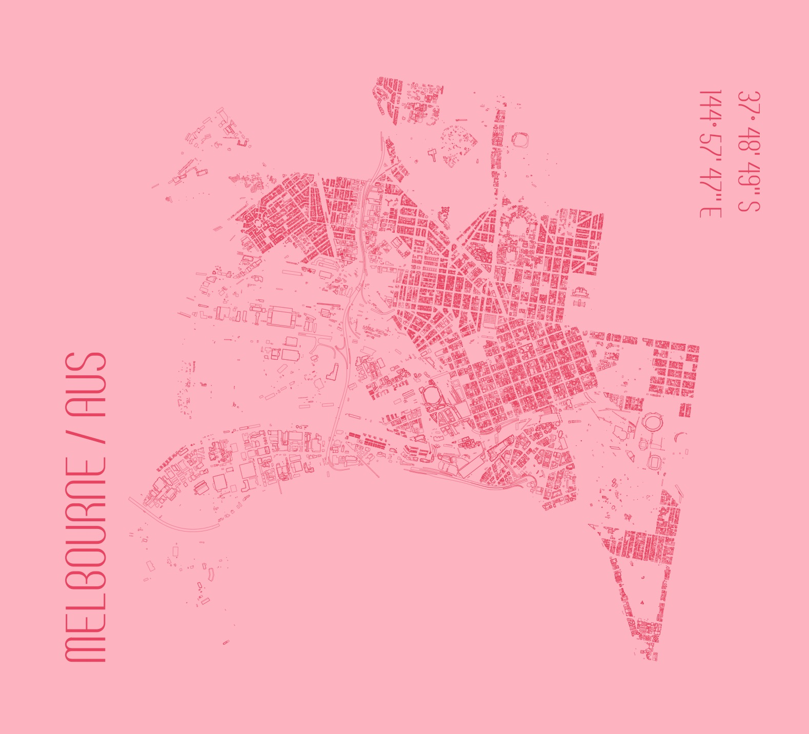
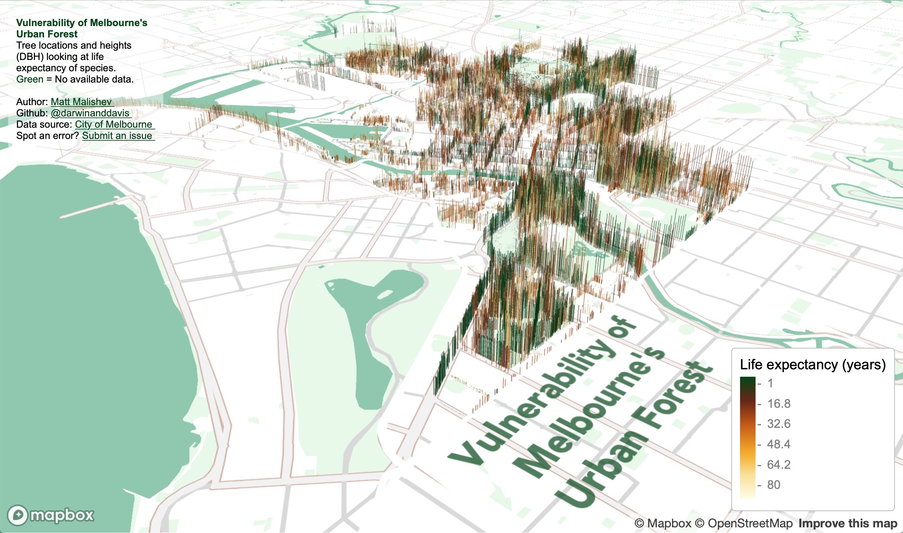
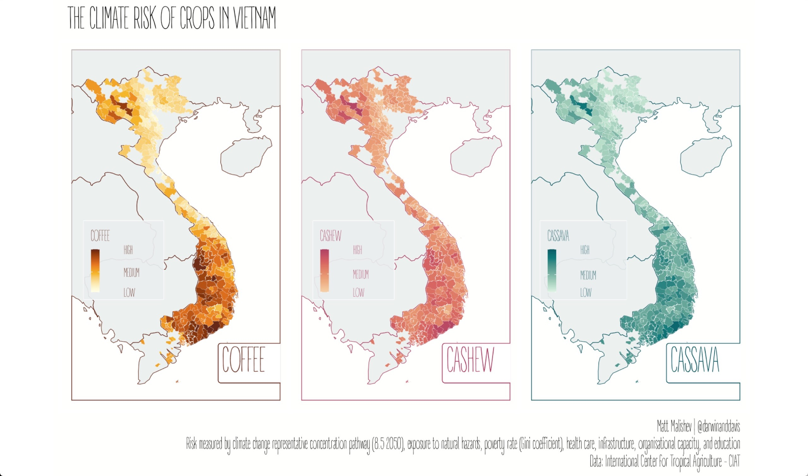
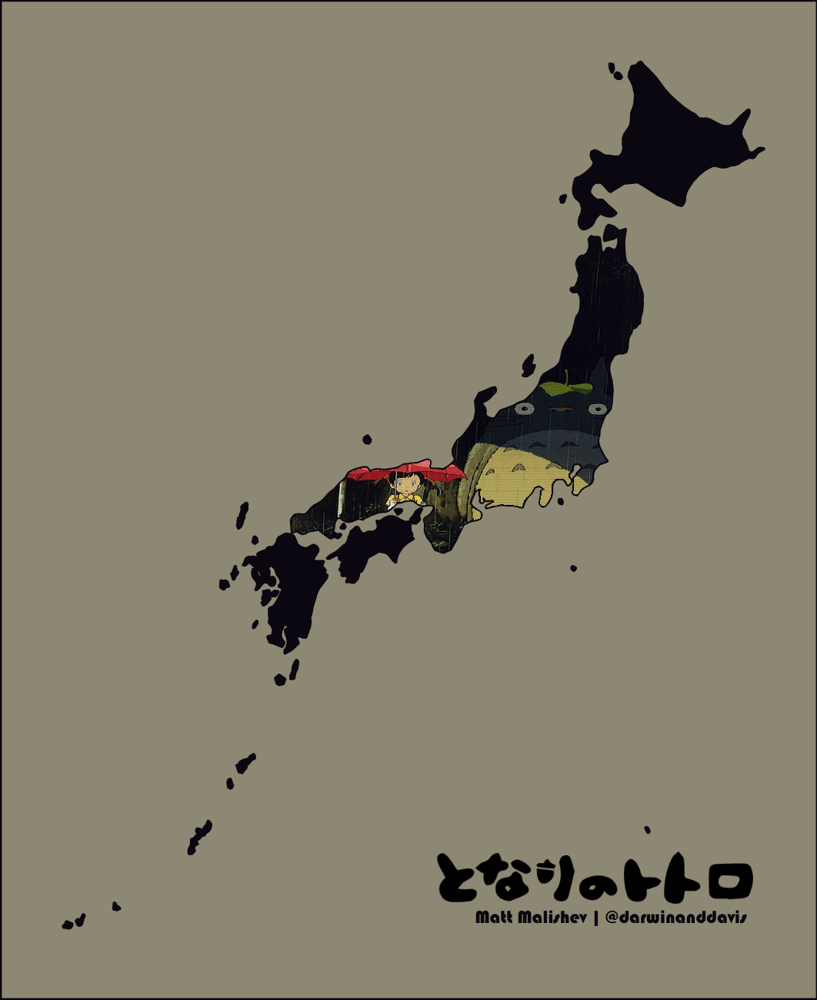
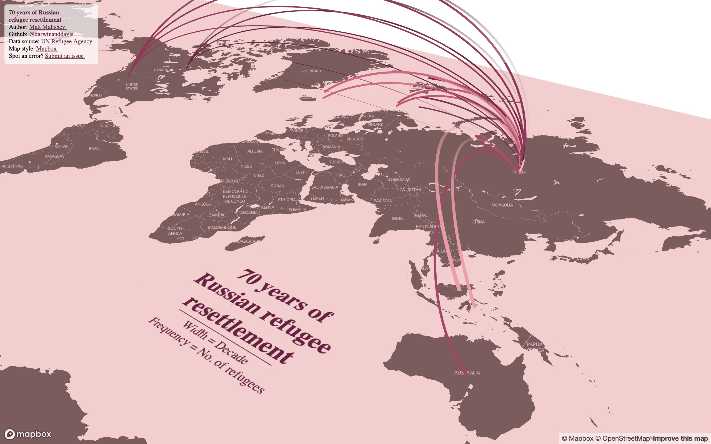

# Some spatial data analysis projects 

### Matt Malishev      

Versions:    
 - R 3.5.0    
 - RStudio 1.1.453        
  
File extensions:     
.R    
.Rmd    
.html      

******      

## 30 day map challenge     

Map entries for the #30dayMapChallenge for November 2020.                 

### Day 1 - Points  

An interactive map of my favourite coffee spots around the world using Mapbox Studio and `R`.         

### [Interactive mobile map of my favourite coffee places around the world](https://darwinanddavis.github.io/worldmaps/30daymap2020/day1)           

<div align="center"; text-align:center>
    
</div>  

### Tools   

R  
Mapbox        
```{r}    
pacman::p_load(here,sf,RColorBrewer,dplyr,ggmap,sp,maptools,scales,rgdal,ggplot2,jsonlite,readr,devtools,colorspace,mapdata,ggsn,mapview,mapproj,ggthemes,reshape2,grid,rnaturalearth,rnaturalearthdata,ggtext,purrr)          
```  
  

### Links      
[`R` code](https://github.com/darwinanddavis/worldmaps/tree/gh-pages/docs/30daymap2020)   

******     

 <!--  -->
 <!--  -->  
 <!--  -->

### Day 4: Hexagons

Mapping my Lyft ride activity from June 2018 to March 2020. 

Using geolocation data for my Lyft rides as a passenger to create an interactive map that shows my destination and origin locations. The data covers the USA.       

* Zoom out to see the cities where I used Lyft to get around. Cities with labels contain data, sometimes only a few points.       
* Note the legend in the below images in case the legend in the link is chopped off.          

### [Mapping my Lyft ride data over two years](https://darwinanddavis.github.io/worldmaps/30daymap2020/day4)    

Atlanta, USA (where I lived during this time)        
<div align="center"; text-align:center>
      
</div>  

### Tools     
  
R   
Mapbox          
R packages: `dplyr`, `mapdeck`, `tibble`, `htmltools`, `sf`, `sfheaders`, `data.table`, `stringr`, `tigris`, `sp` , `here`,`maps`, `colorspace`   

### Links      
[`R` code](https://github.com/darwinanddavis/worldmaps/tree/gh-pages/docs/30daymap2020)   

******       

 <!--  -->
 <!--  -->  
 <!--  -->


### Day 6: Red

Squirrels! The NYC Open Data Squirrel Census on squirrel sightings.  

I've seen these data used many times and I hadn't tried them yet. There are detailed behaviour data too, but location data are fine for this exercise.       
               
### [Cinnamon squirrel locations in NYC Central Park](https://darwinanddavis.github.io/worldmaps/30daymap2020/day6)    
  
<div align="center"; text-align:center>
      
</div>  

### Tools     
  
R           
Mapbox  
```{r}  
pacman::p_load(here,mapdeck,dplyr,purrr,readr)
```      

### Links      
[`R` code](https://github.com/darwinanddavis/worldmaps/tree/gh-pages/docs/30daymap2020)       
Data: [OpenData NYC squirrel census](https://data.cityofnewyork.us/Environment/2018-Central-Park-Squirrel-Census-Squirrel-Data/vfnx-vebw)      

******   

 <!--  -->
 <!--  -->  
 <!--  -->

### Day 8: Yellow      

Australia's global honey export trade              

Mapping Australia's honey exports from publicly available trade data for 2017. Australia is in the top five major exporters for honey.    

### [Australian honey exports for 2017](https://darwinanddavis.github.io/worldmaps/30daymap2020/day8)      
  
<div align="center"; text-align:center>
      
</div>    
  
### Tools     
  
R             
Leaflet    
```{r}    
pacman::p_load(here,dplyr,rworldmap,leaflet,readr,rgeos,purrr,stringr,ggthemes,showtext,geosphere,htmlwidgets)  
```  
    
### Links            
[`R` code](https://github.com/darwinanddavis/worldmaps/tree/gh-pages/docs/30daymap2020)        
[BACI International Trade Database](https://legacy.oec.world/en/resources/data/)             

******   

 <!--  -->
 <!--  -->  
 <!--  -->

### Day 9: Monochrome         

Exploring digital elevation models (DEM) of the Appalachian Trail, USA, with my camping and hiking spots for 2018–2020.              
  
<div align="center"; text-align:center>
      
</div>    
  
### Tools     
  
R             
```{r}    
pacman::p_load(dplyr,readr,rvest,xml2,magrittr,ggplot2,stringr,ggthemes,ggnetwork,elevatr,raster,colorspace,ggtext,ggsn,ggspatial)
```  
    
### Links            
[`R` code](https://github.com/darwinanddavis/worldmaps/tree/gh-pages/docs/30daymap2020)        
  
### Data    
Terrain raster 3DEP data courtesy of the U.S. Geological Survey    
Terrain tiles obtained from [Amazon Web Services](https://registry.opendata.aws/terrain-tiles/)  


******     

 <!--  -->
 <!--  -->  
 <!--  -->

### Day 10 - Grid  

A city footprint of Melbourne, Australia, my home city. There are tonnes of detailed data on the [City of Melbourne open data portal](https://data.melbourne.vic.gov.au/) for some future analyses. I wanted to make a minimal sketch design map that showcases the classic grid structure of Melbourne.  
  
<div align="center"; text-align:center>
    
</div>  

### Tools  

R     
```{r}  
pacman::p_load(dplyr,readr,rvest,xml2,magrittr,sp,sf,rgdal,ggmap,ggplot2,stringr,ggthemes,ggnetwork,colorspace,ggtext,ggsn,ggspatial,showtext)
```   

### Data      
[City of Melbourne Open Data](https://data.melbourne.vic.gov.au/)  

 <!--  -->
 <!--  -->  
 <!--  -->

### Day 11 - 3D   

Vulnerability of Melbourne's urban forest    

I found some comprehensive data on tree canopy coverage in Melbourne from 2019 on the [City of Melbourne Open Data](https://data.melbourne.vic.gov.au/) site and tree traits are always fun to plot in 3D.  

The data cover species, genera, height (DBH), life expectancy, latlons, year and date planted, precinct location, to name a few. I plotted tree locations and height to show some patterns, e.g. you can see where tall trees have been cleared in areas that are known to have high rise apartments buildings. I added life expectancy as the colour factor to get a snapshot idea of planting activity by the city council and choice of species over time. Lots more to explore. 


### [Click for full map](https://darwinanddavis.github.io/worldmaps/30daymap2020/day11) (best in Safari, for some reason)    

<div align="center"; text-align:center>
    
</div> 
  
### Tools     
  
R             
Mapbox    
```{r}    
pacman::p_load(here,mapdeck,dplyr,purrr,readr,showtext,stringr,colorspace,htmltools)  
```  
    
### Links            
[`R` code](https://github.com/darwinanddavis/worldmaps/tree/gh-pages/docs/30daymap2020)        


### Data      
[City of Melbourne Open Data](https://data.melbourne.vic.gov.au/)    


******   

<!--  -->
<!--  -->  
<!--  -->

### Day 14: Climate change  

The climate risk of crops in Vietnam     

Exploring exposure of coffee, cashew, and cassava crops in Vietnam to climate risk.       

There are tonnes of open data on climate change impacts and I've worked a lot with gridded climate, microclimate, environment, and habitat data in the past. I originally planned on doing a risk map for coffee plantations in Colombia (maybe down the track), but the good stuff is paywalled by UNESCO under heritage listing and, of course, there's a daily deadline for this mapping challenge.  

I stumbled across these data from the International Center for Tropical Agriculture (CIAT) on Vietnam, including shp files, and I had to dive in. The risk indices are defined by summed values of climate change representative concentration pathway (8.5 2050), which is an international standard, county exposure to natural hazards, poverty rate (measured by the Gini coefficient), health care, infrastructure, organisational capacity, and education.        
  
### [Click for full map](https://raw.githubusercontent.com/darwinanddavis/worldmaps/gh-pages/img/day14.jpg)      
  
<div align="center"; text-align:center>
    
</div> 
  
### Tools    
  
R               
```{r}    
pacman::p_load(ggfortify,dplyr,here,foreign,rgdal,sp,sf,mapdata,patchwork,readr,purrr,ggplot2,ggthemes,ggnetwork,elevatr,raster,colorspace,ggtext,ggsn,ggspatial,showtext)
```  
    
### Links            
[`R` code](https://github.com/darwinanddavis/worldmaps/tree/gh-pages/docs/30daymap2020)        

### Data        
[CIAT - International Center for Tropical Agriculture Dataverse (CGIAR)](https://ciat.cgiar.org/datasets/)           
Parker, Louis; Bourgoin, Clement; Martinez Valle, Armando; Läderach, Peter, 2018, "VN_CRVA.zip", Climate Risk Vulnerability Assessment to inform sub-national decision making in Vietnam, Nicaragua and Uganda, [https://doi.org/10.7910/DVN/O8GOHP/QZT3YQ, Harvard Dataverse, V2](https://dataverse.harvard.edu/file.xhtml?persistentId=doi:10.7910/DVN/O8GOHP/QZT3YQ)      

******  

 <!--  -->
 <!--  -->  
 <!--  -->


### Day 16: Islands    

For the Miyazaki fans AKA seeing if I could bend `R` to my will.      

My maps are usually data-driven because there are never enough data, but this was a simpler design one where I set the challenge of plotting images/arrays within geom polygons in `R`. An easy enough task in design and image software, but not so trivial in `R`. Turns out it can be done. Shout out to user [@inscaven](https://stackoverflow.com/questions/28206611/adding-custom-image-to-geom-polygon-fill-in-ggplot) on Stackoverflow for the code base.    

I also figured out how to plot images/arrays within polygons for different map projections. I may do a write up on this in the future. For now, this is a useful tool to have in my arsenal.    

There is also the [`ggpattern` package](https://coolbutuseless.github.io/package/ggpattern/index.html) for filling geoms with geometric patterns that I want to dive into to test some of the capabilities.    
 
### [Click for full map](https://raw.githubusercontent.com/darwinanddavis/worldmaps/gh-pages/img/day16.png)   

<div align="center"; text-align:center>
    
</div>      

AKIRA  

### [Click for full map](https://raw.githubusercontent.com/darwinanddavis/worldmaps/gh-pages/img/day16_2.png)          

<div align="center"; text-align:center>
    
</div>                
<br>  


### Tools       
  
R             
```{r}    
pacman::p_load(dplyr,readr,rnaturalearth,rnaturalearthdata,sf,raster,png,plyr,cowplot,mapdata,sp,ggplot2,ggtext)
```  
      
### Links            
[`R` code](https://github.com/darwinanddavis/worldmaps/tree/gh-pages/docs/30daymap2020)        

******    

### Day 20: Population   

The Great Feral Camel Crater of Australia     

Did you know Australia has camels? Millions of feral ones, roaming the deserts like big, roaming, feral camels. There are so many camels, the data almost blew up my laptop trying to map them. Here are some fun facts about Australia's feral camels:  

* Largest global population of feral, dromedary (one-humped) camels  
* 3.3 million km<sup>2</sup> total dispersal range (about 40% of rural Australia)    
* About 0.5–2 camels / kms<sup>2</sup>       
* First introduced in 1840, so that's a long time for camels to settle    
* Compunded annual growth at an enviable 8% pa over the last 70 years      


I found these data online from [Northern Territory's Department of the Environment and Natural Resources](https://data.gov.au/data/dataset/9e807c7f-bc64-47ea-a1f2-87a4609ea69c) and the original research paper from Saalfeld & Edwards (2010). Low density (magenta) represents approx. 0.25 camels, high density (white) represents ~2 camels. Lots of camels.         

### [Click for full map](https://raw.githubusercontent.com/darwinanddavis/worldmaps/gh-pages/img/day20.jpg)          
     
<div align="center"; text-align:center>
    
</div>                
<br>   
  
### Tools     
  
R               
Mapbox    
```{r}    
pacman::p_load(dplyr,here,mapdeck,rgdal,sp,sf,raster,colorspace,mapdata,ggmap,jpeg)  
```  
    
### Links            
[`R` code](https://github.com/darwinanddavis/worldmaps/tree/gh-pages/docs/30daymap2020)          

### Data  
Department of the Environment and Natural Resources – Northern Territory of Australia.    
Saalfeld W. K., Edwards G. P. (2010) Distribution and abundance of the feral camel (_Camelus dromedarius_) in Australia. The Rangeland Journal 32, 1-9, [https://doi.org/10.1071/RJ09058](https://www-publish-csiro-au.eu1.proxy.openathens.net/RJ/RJ09058)  

 <!--  -->
 <!--  -->  
 <!--  -->


******  


### Day 23: Boundaries   

70 years of Russian refugee resettlement    

More of a take on no boundaries through the lense of no boundaries between country borders for refugees, economically-displaced peoples, migrants, and new horizon seekers. 

I found these human migration data online from the [UN Refugee Agency](https://data.world/unhcr) and being close to my own Russian heritage, I wanted to see what patterns in Russian refugee and emigration numbers emerged over the decades. The original dataset is broken up into individual years, but it looked super messy when I first mapped it, so I instead collapsed the data into decades to make for a neater map.    
 
Notes  
* Width of lines = decade of migration scaled relatively from 1950 to 2010    
* Frequency of line movement = proxy for the quantity (number of refugees)   
* Hover over the lines to view the refugee migration numbers for that country 
* Zoom and tilt (hold CMD/CTRL) around the map to explore   

### [Click for full interactive map](https://darwinanddavis.github.io/worldmaps/30daymap2020/day23)    
(Best viewed in Safari and full screen)         
     
<div align="center"; text-align:center>
    
</div>                
<br>   
  
### Tools     
  
R             
Mapbox  
```r 
pacman::p_load(here,dplyr,rworldmap,mapdeck,sf,sfheaders,data.table,readr,rgeos,purrr,stringr,ggthemes,showtext,geosphere,htmlwidgets)
```  
    
### Links            
[`R` code](https://github.com/darwinanddavis/worldmaps/tree/gh-pages/docs/30daymap2020)        

### Data  
[UN Refugee Agency](https://data.world/unhcr)  


 <!--  -->
 <!--  -->  
 <!--  -->


******  

<br>
<a id="day26"></a>  
[](#day26)  
# Day 26: Mapping with a new tool

### Using Framer and Mapbox to design a mobile interface   

I've been meaning to dive into Framer ever since I watched a webinar a few months ago. It's really fun and intuitive. You can integrate Mapbox's features and preload data using imported tilesets, then prototype the interface in Framer.

Lots of things to map for a first project, so here are biking directions from Framer HQ in Amsterdam to my favourite brewery.   

### [Click for interactive mobile prototype](https://framer.com/share/day26--gX1W1or5rDdqG3Rm93n2/ajGqv8pI7?fullscreen=1)       
     
<div align="center"; text-align:center>
    
</div>                
<br>   

If you don't know what Framer is, it's a prototyping tool. Tons of features, interactions, device platforms, graphics, icon sets.  

Here's the process:  

* Import the directional KML data into Mapbox Studio  
* Design the map in Mapbox Studio  
* Link the Mapbox API into Framer and use features such as SequentialLocationMap from the Mapbox components package
* Design the interface (layout, transitions, buttons, etc) in Framer using an iPhone 11 as a template    

The cool thing is you can open the prototype on your own mobile and use regular gestures to navigate the interface. 
  
### Tools     
  
Framer  
Mapbox    
    
### Links            
[Framer](https://www.framer.com/)  

******  

 <!--  -->
 <!--  -->  
 <!--  -->


## Realtime interactive map of coronavirus 2019-nCov global distribution   

[](https://milano-r.github.io/erum2020-covidr-contest/malishev-covid19.html)    

### [Coronavirus 2019-nCov global distribution map](https://darwinanddavis.github.io/worldmaps/coronavirus.html)          

Realtime updates of 2019-nCov global distribution from live scraped [data from the European Centre for Disease Prevention and Control (ECDC)](https://www.ecdc.europa.eu/en/geographical-distribution-2019-ncov-cases).      

### Tools  

R, HTML, CSS    
R packages: `maps`,`readr`,`dplyr`,`leaflet`,`xml2`,`rvest`,`ggmap`,`geosphere`,`htmltools`,`mapview`,`rnaturalearth`,`purrr`          


<div align="center"; text-align:center>
    
</div>  
  
## Visualising Airbnb open data    

### [**San Francisco property type and ratings**](https://darwinanddavis.github.io/worldmaps/airbnb_sf.html)          

Spatial analysis of Airbnb listing and ratings for the San Francisco area.    

### Tools  

R, HTML, CSS  
R packages: `readr` `dplyr`, `leaflet`, `colorspace`   

<div align="center"; text-align:center>
    
</div>


## Maintainer    

**Matt Malishev**     
:mag: [Website](https://darwinanddavis.github.io/DataPortfolio/)      
:bird: [@darwinanddavis](https://twitter.com/darwinanddavis)    
:email: matthew.malishev [at] gmail.com        

