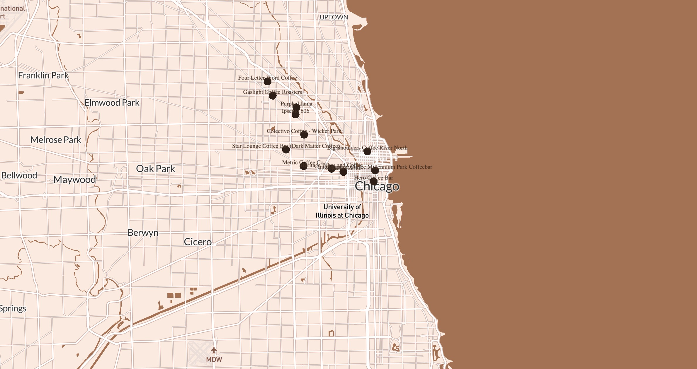
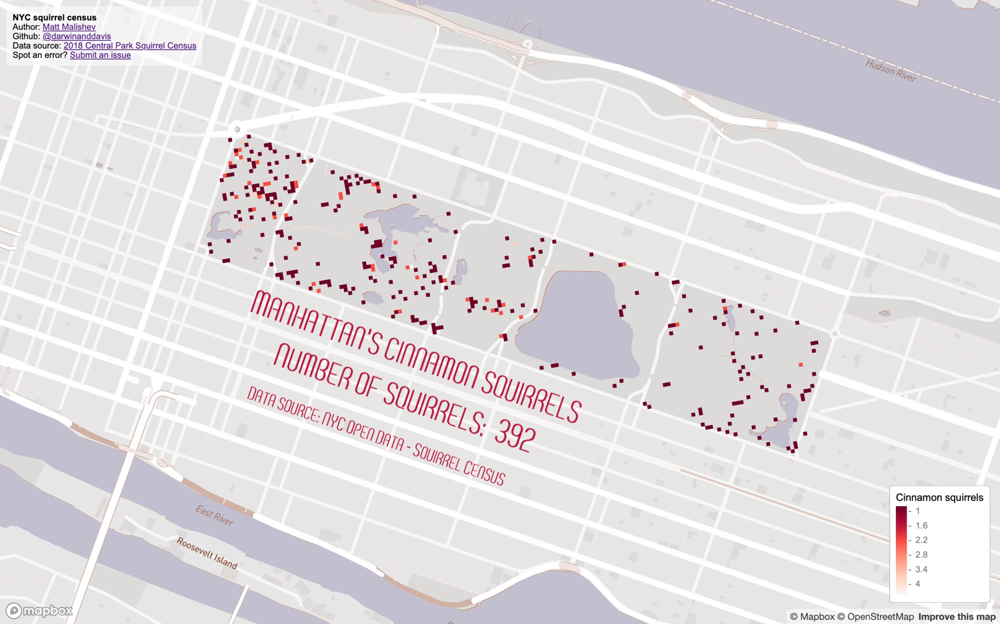
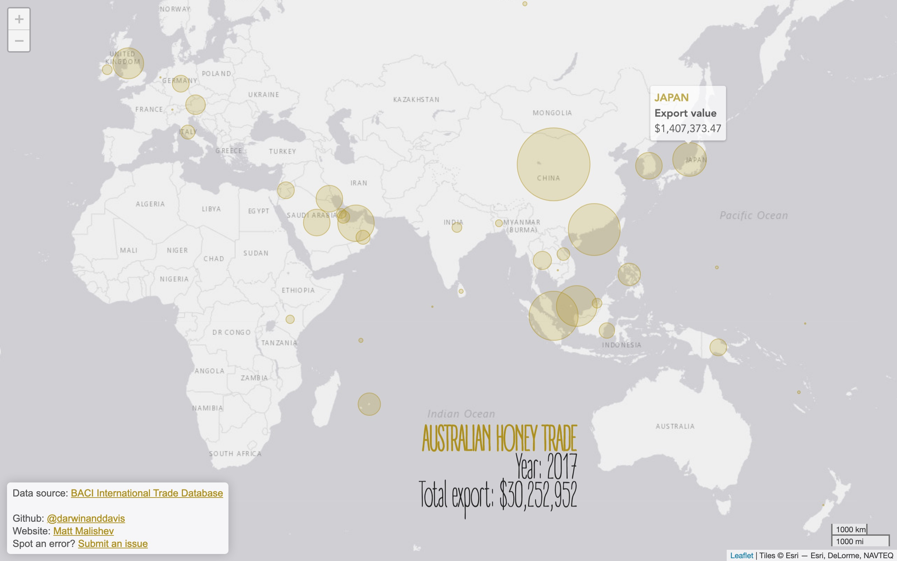
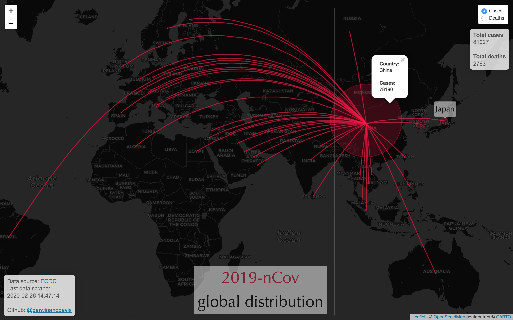

# Some spatial data analysis projects 

### Matt Malishev      

Versions:    
 - R 3.5.0    
 - RStudio 1.1.453        
  
File extensions:     
.R    
.Rmd    
.html      

******      

## 30 day map challenge     

Map entries for the #30dayMapChallenge for November 2020.                 

### Day 1 - Points  

An interactive map of my favourite coffee spots around the world using Mapbox Studio and `mapdeck` in `R`.       

### [Interactive mobile map of favourite coffee places around the world](https://darwinanddavis.github.io/worldmaps/30daymap2020/day1)           

<div align="center"; text-align:center>
    
</div>  

### Tools   

R  
Mapbox        
```{r}    
pacman::p_load(here,sf,RColorBrewer,dplyr,ggmap,sp,maptools,scales,rgdal,ggplot2,jsonlite,readr,devtools,colorspace,mapdata,ggsn,mapview,mapproj,ggthemes,reshape2,grid,rnaturalearth,rnaturalearthdata,ggtext,purrr)          
```  
  

### Links      
[`R` code](https://github.com/darwinanddavis/worldmaps/tree/gh-pages/docs/30daymap2020)   

******     

 <!--  -->
 <!--  -->  
 <!--  -->

### Day 2: Lines      

Using geolocation data to map a roadtrip across the southern US with `R`.  
  
<div align="center"; text-align:center>
    
</div>  

### Tools  

R  
Mapbox        
```{r}  
pacman::p_load(here,sf,RColorBrewer,dplyr,ggmap,sp,maptools,scales,rgdal,ggplot2,jsonlite,readr,devtools,colorspace,mapdata,ggsn,mapview,mapproj,ggthemes,reshape2,grid,rnaturalearth,rnaturalearthdata,ggtext,purrr)          
```      

******     

 <!--  -->
 <!--  -->  
 <!--  -->

### Day 4: Hexagons

Mapping my Lyft ride activity from June 2018 to March 2020. 

Using geolocation data for my Lyft rides as a passenger to create an interactive map that shows my destination and origin locations. The data covers the USA.       

* Zoom out to see the cities where I used Lyft to get around. Cities with labels contain data, sometimes only a few points.       
* Note the legend in the below images in case the legend in the link is chopped off.          

### [Mapping my Lyft ride data over two years](https://darwinanddavis.github.io/worldmaps/30daymap2020/day4)    

Atlanta, USA (where I lived during this time)        
<div align="center"; text-align:center>
      
</div>  

### Tools     
  
R   
Mapbox          
R packages: `dplyr`, `mapdeck`, `tibble`, `htmltools`, `sf`, `sfheaders`, `data.table`, `stringr`, `tigris`, `sp` , `here`,`maps`, `colorspace`   

### Links      
[`R` code](https://github.com/darwinanddavis/worldmaps/tree/gh-pages/docs/30daymap2020)   

******       

 <!--  -->
 <!--  -->  
 <!--  -->


### Day 6: Red

Squirrels! The NYC Open Data Squirrel Census on squirrel sightings.  

I've seen these data used many times and I hadn't tried them yet. There are detailed behaviour data too, but location data are fine for this exercise.       
               
### [Cinnamon squirrel locations in NYC Central Park](https://darwinanddavis.github.io/worldmaps/30daymap2020/day6)    
  
<div align="center"; text-align:center>
      
</div>  

### Tools     
  
R           
Mapbox  
```{r}  
pacman::p_load(here,mapdeck,dplyr,purrr,readr)
```      

### Links      
[`R` code](https://github.com/darwinanddavis/worldmaps/tree/gh-pages/docs/30daymap2020)       
Data: [OpenData NYC squirrel census](https://data.cityofnewyork.us/Environment/2018-Central-Park-Squirrel-Census-Squirrel-Data/vfnx-vebw)      

******   

 <!--  -->
 <!--  -->  
 <!--  -->

### Day 8: Yellow      

Australia's global honey export trade              

Mapping Australia's honey exports from publicly available trade data for 2017. Australia is in the top five major exporters for honey.    

### [Australian honey exports for 2017](https://darwinanddavis.github.io/worldmaps/30daymap2020/day8)      
  
<div align="center"; text-align:center>
      
</div>    
  
### Tools     
  
R             
Leaflet    
```{r}    
pacman::p_load(here,dplyr,rworldmap,leaflet,readr,rgeos,purrr,stringr,ggthemes,showtext)  
```  
    
### Links            
[`R` code](https://github.com/darwinanddavis/worldmaps/tree/gh-pages/docs/30daymap2020)        
[BACI International Trade Database](https://legacy.oec.world/en/resources/data/)             

******   

 <!--  -->
 <!--  -->  
 <!--  -->

## Realtime interactive map of coronavirus 2019-nCov global distribution   

[](https://milano-r.github.io/erum2020-covidr-contest/malishev-covid19.html)    

### [Coronavirus 2019-nCov global distribution map](https://darwinanddavis.github.io/worldmaps/coronavirus.html)          

Realtime updates of 2019-nCov global distribution from live scraped [data from the European Centre for Disease Prevention and Control (ECDC)](https://www.ecdc.europa.eu/en/geographical-distribution-2019-ncov-cases).      

### Tools  

R, HTML, CSS    
R packages: `maps`,`readr`,`dplyr`,`leaflet`,`xml2`,`rvest`,`ggmap`,`geosphere`,`htmltools`,`mapview`,`rnaturalearth`,`purrr`          


<div align="center"; text-align:center>
    
</div>  
  
## Visualising Airbnb open data    

### [**San Francisco property type and ratings**](https://darwinanddavis.github.io/worldmaps/airbnb_sf.html)          

Spatial analysis of Airbnb listing and ratings for the San Francisco area.    

### Tools  

R, HTML, CSS  
R packages: `readr` `dplyr`, `leaflet`, `colorspace`   

<div align="center"; text-align:center>
    
</div>


## Maintainer    

**Matt Malishev**     
:mag: [Website](https://darwinanddavis.github.io/DataPortfolio/)      
:bird: [@darwinanddavis](https://twitter.com/darwinanddavis)    
:email: matthew.malishev [at] gmail.com        

