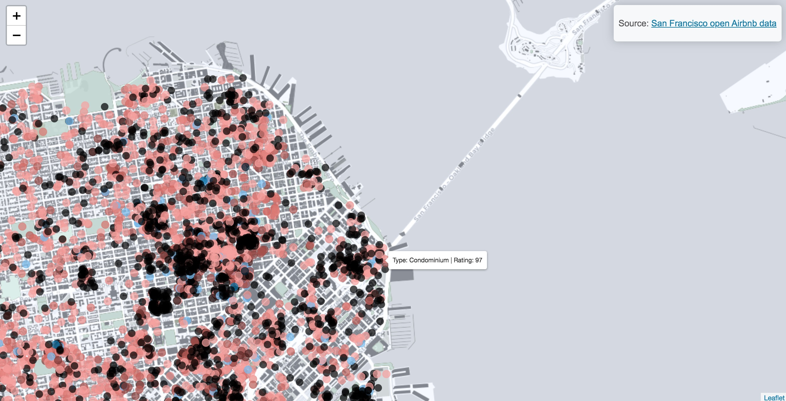

# Some spatial data analysis projects 

### Matt Malishev      

Versions:    
 - R 3.5.0    
 - RStudio 1.1.453        
  
File extensions:     
.R    
.Rmd    
.html      

******      

## Visualising Airbnb open data  

[**San Francisco property type and ratings**](https://darwinanddavis.github.io/worldmaps/airbnb_sf.html)          

    

## Maintainer    

**Matt Malishev**     
:mag: [Website](https://darwinanddavis.github.io/DataPortfolio/)      
:bird: [@darwinanddavis](https://twitter.com/darwinanddavis)    
:email: matthew.malishev [at] gmail.com        

